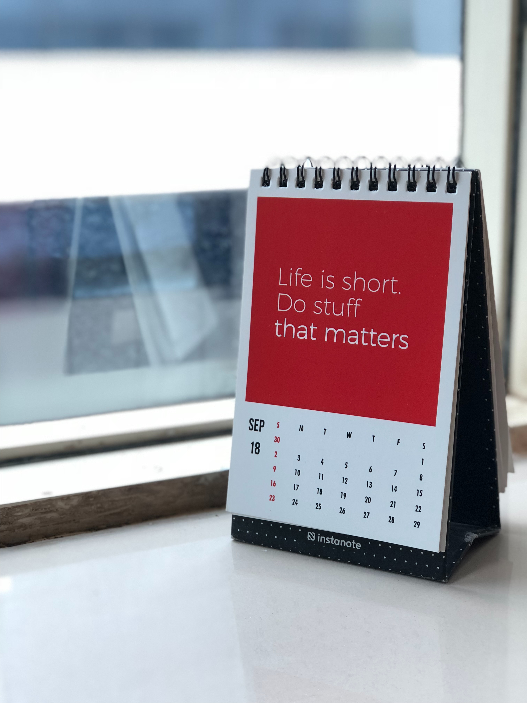

<div style="display:flex;">




</div>

# Jovian Flask Todo Assessment 💼

## Project Name: ToDo List ✅

### A project for the Jovian Web Development Course [](https://jovian.com/learn/web-development-with-python-and-flask)

## Project Description 📝

This is a simple ToDo List App developed for the Jovian Web Development Course. It includes the following features:

- ✅ Login/Signup
- ✅ Add a ToDo
- ✅ Update the status of a ToDo
- ✅ Delete a ToDo

## Project Links 🔗

- [Source Code](https://github.com/Ravikisha/jovian_assessment_flask) [](https://github.com/Ravikisha/jovian_assessment_flask)
- [Deployed Link](https://todo-list-4bhz.onrender.com/) [](https://todo-list-4bhz.onrender.com/)


<p>
<h2>Project Stack</h2>


</p>

## Installation Steps 🚀

To run this project locally, follow these steps:

1. **Clone the Repository:**

   ```bash
   git clone https://github.com/Ravikisha/jovian_assessment_flask.git
   cd jovian_assessment_flask
   ```

2. **Set Up a Virtual Environment:**

   Create a virtual environment to isolate project dependencies:

   ```bash
   python -m venv venv
   source venv/bin/activate  # On Windows, use `venv\Scripts\activate`
   ```

3. **Install Dependencies:**

   Install the required Python packages:

   ```bash
   pip install -r requirements.txt
   ```


4. **Setup application in Commmand**
   
   Setup the application using the following commands:

   ```bash
    export FLASK_APP=app.py
    export FLASK_ENV=development
    ```

5. **Run the Application:**

   Start the Flask app:

   ```bash
   flask run
   ```

6. **Access the App:**

   Open your web browser and go to `http://localhost:5000` to use the ToDo List App.


## Project Screenshots 📷


## Contribution

Contributions are welcome! If you'd like to contribute to the Jovian Flask Todo Assessment project, please check out the [CONTRIBUTING.md](CONTRIBUTING.md) file for guidelines and instructions.

## License

This project is licensed under the MIT License. See the [LICENSE](LICENSE) file for details.

Feel free to explore and contribute to the Jovian Flask Todo Assessment! 🚀✨